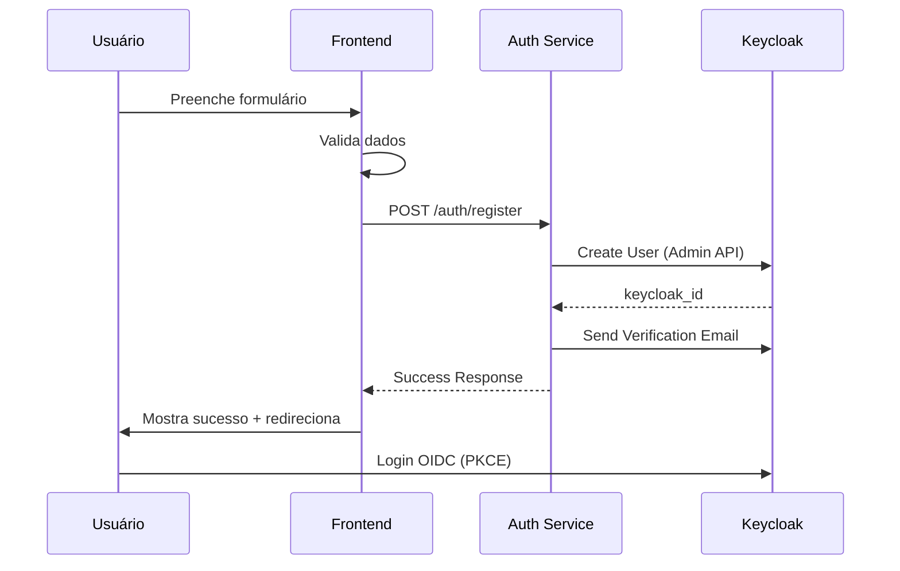

#FRONTEND_REGISTRATION_GUIDE.md
# Guia de Implementação - Cadastro de Usuários

## Visão Geral

Este documento descreve como implementar o fluxo de cadastro de usuários no frontend, integrando com o auth_service via Keycloak Admin API.

**✅ SISTEMA TESTADO E FUNCIONANDO PERFEITAMENTE!**

## Arquitetura do Fluxo



## 1. Formulário de Cadastro

### Campos Obrigatórios

| Campo | Tipo | Validação | Exemplo |
|-------|------|-----------|---------|
| `cpf` | string | CPF válido, único | `123.456.789-00` |
| `email` | email | formato válido, único | `usuario@exemplo.com` |
| `first_name` | string | 2-100 chars | `João` |
| `last_name` | string | 2-100 chars | `Silva` |

### Campos Opcionais

| Campo | Tipo | Validação | Exemplo |
|-------|------|-----------|---------|
| `phone` | string | formato internacional | `+55-11-99999-9999` |
| `password` | string | 6+ chars (se fornecido) | `senha123` |

### Estrutura do Formulário

```typescript
interface RegistrationForm {
  cpf: string; // CPF do usuário (obrigatório)
  email: string; // Email (obrigatório)
  first_name: string; // Nome (obrigatório)
  last_name: string; // Sobrenome (obrigatório)
  phone?: string; // Telefone internacional (opcional)
  password?: string; // Senha (opcional)
}
```

## 2. Validações do Frontend

### Validações de Campo

```typescript
// Função para validar CPF
const validateCPF = (cpf: string): boolean => {
  cpf = cpf.replace(/[^\d]/g, '');
  if (cpf.length !== 11) return false;
  if (/^(\d)\1{10}$/.test(cpf)) return false;
  
  let soma = 0;
  for (let i = 0; i < 9; i++) {
    soma += parseInt(cpf[i]) * (10 - i);
  }
  let resto = soma % 11;
  let digito1 = resto < 2 ? 0 : 11 - resto;
  
  soma = 0;
  for (let i = 0; i < 10; i++) {
    soma += parseInt(cpf[i]) * (11 - i);
  }
  resto = soma % 11;
  let digito2 = resto < 2 ? 0 : 11 - resto;
  
  return cpf.slice(-2) === `${digito1}${digito2}`;
};

const validations = {
  cpf: {
    required: true,
    minLength: 11,
    maxLength: 20,
    validate: validateCPF,
    message: "CPF deve ser válido"
  },
  email: {
    required: true,
    pattern: /^[a-zA-Z0-9._%+-]+@[a-zA-Z0-9.-]+\.[a-zA-Z]{2,}$/,
    message: "Email deve ter formato válido"
  },
  phone: {
    required: false, // ✅ OPCIONAL
    minLength: 10,
    maxLength: 20,
    pattern: /^\+[1-9]\d{1,3}-\d{1,4}-\d{4,15}$/,
    message: "Telefone deve estar no formato internacional: +pais-dd-telefone"
  },
  first_name: {
    required: true,
    minLength: 2,
    maxLength: 100,
    pattern: /^[a-zA-ZÀ-ÿ\s]+$/, // apenas letras e espaços
    message: "Nome deve ter entre 2 e 100 caracteres"
  },
  last_name: {
    required: true,
    minLength: 2,
    maxLength: 100,
    pattern: /^[a-zA-ZÀ-ÿ\s]+$/, // apenas letras e espaços
    message: "Sobrenome deve ter entre 2 e 100 caracteres"
  },
  password: {
    required: false,
    minLength: 6,
    pattern: /^(?=.*[a-z])(?=.*[A-Z])(?=.*\d)(?=.*[@$!%*?&])[A-Za-z\d@$!%*?&]{8,}$/,
    message: "Senha deve ter pelo menos 8 caracteres, incluindo maiúscula, minúscula, número e caractere especial"
  }
};
```

### Validação em Tempo Real

```typescript
const validateField = (field: string, value: string): string | null => {
  const validation = validations[field];
  
  if (validation.required && !value) {
    return `${field} é obrigatório`;
  }
  
  if (value && validation.minLength && value.length < validation.minLength) {
    return `${field} deve ter pelo menos ${validation.minLength} caracteres`;
  }
  
  if (value && validation.maxLength && value.length > validation.maxLength) {
    return `${field} deve ter no máximo ${validation.maxLength} caracteres`;
  }
  
  if (value && validation.pattern && !validation.pattern.test(value)) {
    return validation.message;
  }
  
  return null;
};
```

## 3. Requisição para o Backend

### Endpoint

```
POST /api/v1/auth/register
Content-Type: application/json
```

### Payload

```json
{
  "cpf": "123.456.789-00", // CPF do usuário (obrigatório)
  "email": "usuario@exemplo.com", // Email (obrigatório)
  "first_name": "João", // Nome (obrigatório)
  "last_name": "Silva", // Sobrenome (obrigatório)
  "phone": "+55-11-99999-9999", // Telefone internacional (opcional)
  "password": "senha123" // Senha (opcional)
}
```

### Exemplos de Teste Realizados ✅

#### Teste 1: Cadastro SEM telefone
```json
{
  "cpf": "22255588846",
  "email": "sem_telefone@exemplo.com",
  "first_name": "Maria",
  "last_name": "Santos"
}
```

#### Teste 2: Cadastro COM telefone
```json
{
  "cpf": "33366699957",
  "email": "com_telefone@exemplo.com",
  "first_name": "Carlos",
  "last_name": "Oliveira",
  "phone": "+55-21-987654321"
}
```

### Exemplo de Implementação (JavaScript/TypeScript)

```typescript
interface RegistrationRequest {
  cpf: string;
  email: string;
  first_name: string;
  last_name: string;
  phone?: string; // ✅ OPCIONAL
  password?: string;
}

interface RegistrationResponse {
  success: boolean;
  keycloak_id?: string;
  message: string;
  user_data?: {
    id: string;
    username: string;
    email: string;
    firstName: string;
    lastName: string;
    enabled: boolean;
    emailVerified: boolean;
    attributes: Record<string, string[]>;
  };
}

const registerUser = async (userData: RegistrationRequest): Promise<RegistrationResponse> => {
  try {
    const response = await fetch('/api/v1/auth/register', {
      method: 'POST',
      headers: {
        'Content-Type': 'application/json',
      },
      body: JSON.stringify(userData),
    });

    if (!response.ok) {
      const errorData = await response.json();
      throw new Error(errorData.detail || 'Erro no cadastro');
    }

    return await response.json();
  } catch (error) {
    throw new Error(`Falha no cadastro: ${error.message}`);
  }
};
```

### Exemplo de Implementação (React)

```tsx
import React, { useState } from 'react';

interface RegistrationForm {
  cpf: string;
  email: string;
  first_name: string;
  last_name: string;
  phone?: string; // ✅ OPCIONAL
  password?: string;
}

const RegistrationForm: React.FC = () => {
  const [formData, setFormData] = useState<RegistrationForm>({
    cpf: '',
    email: '',
    first_name: '',
    last_name: '',
    phone: '',
    password: ''
  });
  
  const [errors, setErrors] = useState<Partial<RegistrationForm>>({});
  const [isLoading, setIsLoading] = useState(false);
  const [success, setSuccess] = useState(false);

  const handleSubmit = async (e: React.FormEvent) => {
    e.preventDefault();
    setIsLoading(true);
    setErrors({});

    try {
      // Validar formulário
      const validationErrors = validateForm(formData);
      if (Object.keys(validationErrors).length > 0) {
        setErrors(validationErrors);
        return;
      }

      // Enviar requisição
      const response = await registerUser(formData);
      
      if (response.success) {
        setSuccess(true);
        // Redirecionar para login ou mostrar mensagem de sucesso
        setTimeout(() => {
          window.location.href = '/login';
        }, 3000);
      }
    } catch (error) {
      setErrors({ cpf: error.message });
    } finally {
      setIsLoading(false);
    }
  };

  return (
    <form onSubmit={handleSubmit}>
      <div>
        <label>CPF *</label>
        <input
          type="text"
          value={formData.cpf}
          onChange={(e) => setFormData({...formData, cpf: e.target.value})}
          placeholder="123.456.789-00"
          required
        />
        {errors.cpf && <span className="error">{errors.cpf}</span>}
      </div>

      <div>
        <label>Email *</label>
        <input
          type="email"
          value={formData.email}
          onChange={(e) => setFormData({...formData, email: e.target.value})}
          placeholder="seu@email.com"
          required
        />
        {errors.email && <span className="error">{errors.email}</span>}
      </div>

      <div>
        <label>Telefone (opcional)</label>
        <input
          type="tel"
          value={formData.phone}
          onChange={(e) => setFormData({...formData, phone: e.target.value})}
          placeholder="+55-11-99999-9999"
        />
        {errors.phone && <span className="error">{errors.phone}</span>}
        <small className="help-text">Formato internacional: +pais-dd-telefone</small>
      </div>

      <div>
        <label>Nome *</label>
        <input
          type="text"
          value={formData.first_name}
          onChange={(e) => setFormData({...formData, first_name: e.target.value})}
          required
        />
        {errors.first_name && <span className="error">{errors.first_name}</span>}
      </div>

      <div>
        <label>Sobrenome *</label>
        <input
          type="text"
          value={formData.last_name}
          onChange={(e) => setFormData({...formData, last_name: e.target.value})}
          required
        />
        {errors.last_name && <span className="error">{errors.last_name}</span>}
      </div>

      <div>
        <label>Senha (opcional)</label>
        <input
          type="password"
          value={formData.password}
          onChange={(e) => setFormData({...formData, password: e.target.value})}
        />
        {errors.password && <span className="error">{errors.password}</span>}
      </div>

      <button type="submit" disabled={isLoading}>
        {isLoading ? 'Cadastrando...' : 'Cadastrar'}
      </button>

      {success && (
        <div className="success">
          <h3>Cadastro realizado com sucesso!</h3>
          <p>Verifique seu email para ativar a conta.</p>
          <p><strong>Importante:</strong> Para fazer login, você pode usar seu CPF ou email como usuário.</p>
        </div>
      )}
    </form>
  );
};
```

## 4. Respostas do Backend

### Sucesso (200) - Exemplo Real ✅

```json
{
  "success": true,
  "keycloak_id": "4c009c5b-a1fc-4a49-89ac-9875b3cfa5ae",
  "message": "Usuário criado com sucesso. Verifique seu e-mail para ativar a conta.",
  "user_data": {
    "id": "4c009c5b-a1fc-4a49-89ac-9875b3cfa5ae",
    "username": "33366699957",
    "email": "com_telefone@exemplo.com",
    "firstName": "Carlos",
    "lastName": "Oliveira",
    "enabled": true,
    "emailVerified": false,
    "attributes": {
      "aceiteTermos": ["true"],
      "source": ["auth_service"],
      "created_at": ["2025-08-21T19:40:16.999103"],
      "cpf": ["33366699957"],
      "cpf_formatted": ["33366699957"],
      "phone": ["+55-21-987654321"]
    }
  }
}
```

### Erros Comuns

#### 400 - Dados Inválidos
```json
{
  "detail": "Dados de entrada inválidos",
  "errors": {
    "email": "Email deve ter formato válido",
    "first_name": "Nome deve ter entre 2 e 100 caracteres"
  }
}
```

#### 409 - Usuário Já Existe
```json
{
  "detail": "Usuário já existe no sistema. CPF ou email já cadastrado."
}
```

#### 500 - Erro Interno
```json
{
  "detail": "Erro interno do servidor"
}
```

## 5. Fluxo de Sucesso

### 1. Cadastro Bem-sucedido
- Mostrar mensagem de sucesso
- Explicar sobre verificação de email
- Redirecionar para página de login

### 2. Verificação de Email
- Usuário recebe email do Keycloak
- Clica no link de verificação
- Email é verificado no Keycloak

### 3. Primeiro Login
- Usuário acessa página de login
- Faz login via OIDC/PKCE
- É redirecionado para aplicação

## 6. Verificação de Usuário Existente

### Endpoint de Verificação

```
GET /api/v1/auth/check-user?cpf=123.456.789-00
GET /api/v1/auth/check-user?email=usuario@exemplo.com
```

### Resposta - Usuário Existe

```json
{
  "exists": true,
  "message": "Usuário já existe no sistema",
  "user_info": {
    "id": "4c009c5b-a1fc-4a49-89ac-9875b3cfa5ae",
    "username": "33366699957",
    "email": "com_telefone@exemplo.com",
    "enabled": true,
    "emailVerified": false
  }
}
```

### Resposta - Usuário Não Existe

```json
{
  "exists": false,
  "message": "Usuário não encontrado"
}
```

### Implementação no Frontend

```typescript
const checkUserExists = async (cpf?: string, email?: string): Promise<boolean> => {
  try {
    const params = new URLSearchParams();
    if (cpf) params.append('cpf', cpf);
    if (email) params.append('email', email);
    
    const response = await fetch(`/api/v1/auth/check-user?${params}`);
    const data = await response.json();
    
    return data.exists;
  } catch (error) {
    console.error('Erro ao verificar usuário:', error);
    return false;
  }
};

// Uso no formulário
const handleCPFChange = async (cpf: string) => {
  if (validateCPF(cpf)) {
    const exists = await checkUserExists(cpf);
    if (exists) {
      setErrors({ cpf: 'CPF já cadastrado no sistema' });
    }
  }
};
```

## 7. Tratamento de Erros

### Erros de Validação
```typescript
const handleValidationError = (error: any) => {
  if (error.errors) {
    // Erros de validação específicos
    setErrors(error.errors);
  } else {
    // Erro geral
    setErrors({ cpf: error.detail });
  }
};
```

### Erros de Rede
```typescript
const handleNetworkError = (error: any) => {
  if (error.name === 'TypeError') {
    // Erro de conexão
    setErrors({ cpf: 'Erro de conexão. Verifique sua internet.' });
  } else {
    // Outros erros
    setErrors({ cpf: 'Erro inesperado. Tente novamente.' });
  }
};
```

### Rate Limiting
```typescript
const handleRateLimit = (error: any) => {
  if (error.status === 429) {
    setErrors({ cpf: 'Muitas tentativas. Aguarde alguns minutos.' });
  }
};
```

## 8. UX/UI Recomendações

### Estados do Formulário
1. **Vazio**: Campos limpos, botão desabilitado
2. **Preenchendo**: Validação em tempo real
3. **Enviando**: Loading spinner, botão desabilitado
4. **Sucesso**: Mensagem de sucesso, redirecionamento
5. **Erro**: Mensagens de erro específicas

### Feedback Visual
- ✅ Campos válidos: borda verde
- ❌ Campos inválidos: borda vermelha + mensagem
- ⏳ Loading: spinner no botão
- 🎉 Sucesso: mensagem verde + ícone

### Acessibilidade
- Labels associados aos campos
- Mensagens de erro claras
- Navegação por teclado
- Contraste adequado

## 9. Segurança

### Validação Dupla
- Frontend: UX e performance
- Backend: Segurança e integridade

### Sanitização
- Remover caracteres especiais perigosos
- Validar tipos de dados
- Prevenir XSS

### Rate Limiting
- Limitar tentativas de cadastro
- Implementar CAPTCHA se necessário
- Monitorar tentativas suspeitas

## 10. Testes

### Testes Unitários
```typescript
describe('Registration Form', () => {
  test('should validate email format', () => {
    expect(validateField('email', 'invalid-email')).toBeTruthy();
    expect(validateField('email', 'valid@email.com')).toBeNull();
  });

  test('should validate required fields', () => {
    expect(validateField('first_name', '')).toBeTruthy();
    expect(validateField('first_name', 'João')).toBeNull();
  });
});
```

### Testes de Integração
```typescript
describe('Registration API', () => {
  test('should create user successfully', async () => {
    const userData = {
      cpf: '12345678900',
      email: 'test@example.com',
      first_name: 'Test',
      last_name: 'User',
      phone: '+55-11-999999999'
    };

    const response = await registerUser(userData);
    expect(response.success).toBe(true);
    expect(response.keycloak_id).toBeDefined();
  });
});
```

## 11. Monitoramento

### Métricas Importantes
- Taxa de sucesso no cadastro
- Tempo de resposta da API
- Erros de validação mais comuns
- Abandono do formulário

### Logs
- Tentativas de cadastro
- Erros de validação
- Falhas de API
- Comportamentos suspeitos

## 12. Exemplo Completo (React + TypeScript)

```tsx
// components/RegistrationForm.tsx
import React, { useState } from 'react';
import { validateField, validations } from '../utils/validation';
import { registerUser } from '../services/auth';

export const RegistrationForm: React.FC = () => {
  // ... implementação completa conforme exemplo anterior
};
```

```typescript
// services/auth.ts
export const registerUser = async (userData: RegistrationRequest): Promise<RegistrationResponse> => {
  // ... implementação conforme exemplo anterior
};
```

```typescript
// utils/validation.ts
export const validations = {
  // ... validações conforme exemplo anterior
};

export const validateField = (field: string, value: string): string | null => {
  // ... implementação conforme exemplo anterior
};
```

## 13. Checklist de Implementação

- [x] ✅ Formulário com todos os campos obrigatórios
- [x] ✅ Validação em tempo real
- [x] ✅ Tratamento de erros
- [x] ✅ Estados de loading
- [x] ✅ Mensagens de sucesso
- [x] ✅ Redirecionamento após sucesso
- [ ] Testes unitários
- [ ] Testes de integração
- [ ] Acessibilidade
- [ ] Responsividade
- [ ] Monitoramento
- [ ] Documentação

## 14. Status de Testes ✅

### Testes Realizados com Sucesso:

1. **Cadastro SEM telefone** ✅
   - CPF: `22255588846`
   - Email: `sem_telefone@exemplo.com`
   - Keycloak ID: `73cce552-fd0b-49cc-b9a7-70d1813b2a4c`

2. **Cadastro COM telefone** ✅
   - CPF: `33366699957`
   - Email: `com_telefone@exemplo.com`
   - Telefone: `+55-21-987654321`
   - Keycloak ID: `4c009c5b-a1fc-4a49-89ac-9875b3cfa5ae`

### Atributos Salvos no Keycloak:
- ✅ `aceiteTermos`: `true`
- ✅ `source`: `auth_service`
- ✅ `created_at`: timestamp ISO
- ✅ `cpf`: CPF limpo (apenas números)
- ✅ `cpf_formatted`: CPF original
- ✅ `phone`: telefone internacional (quando fornecido)

## 15. Suporte

Para dúvidas sobre implementação:
- Consulte a documentação da API
- Verifique os logs do backend
- Teste com o script de validação
- Entre em contato com o time de backend

---

**Versão**: 2.0  
**Última atualização**: Agosto 2025  
**Autor**: Time de Backend - Auth Service  
**Status**: ✅ **SISTEMA TESTADO E FUNCIONANDO**
