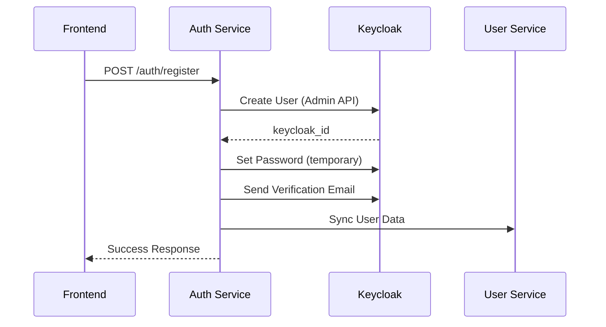
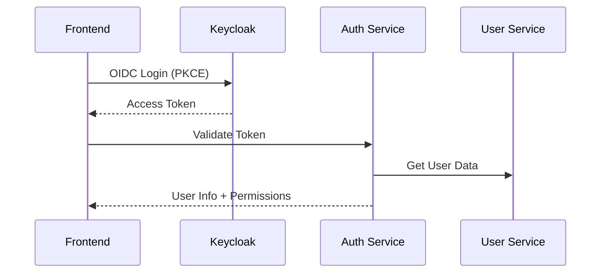

# Sistema de Cadastro via Keycloak Admin API

## Visão Geral

Este documento descreve a implementação do sistema de cadastro de usuários via Keycloak Admin API no auth_service. O sistema permite criar usuários no Keycloak de forma controlada através do backend, mantendo a separação entre dados de autenticação e dados de negócio.

## Arquitetura

### Fluxo de Cadastro

1. **Frontend** → Chama `/auth/register` com dados do usuário
2. **Auth Service** → Cria usuário no Keycloak via Admin API
3. **Auth Service** → Define senha temporária (opcional)
4. **Auth Service** → Envia e-mail de verificação
5. **Auth Service** → Sincroniza com user_service (futuro)
6. **Frontend** → Redireciona para login OIDC normal

### Separação de Responsabilidades

- **Keycloak**: Dados de autenticação (username, email, senha, roles)
- **User Service**: Dados de negócio (perfil, preferências, limites, etc.)
- **Auth Service**: Orquestração e sincronização

## Configuração

### 1. Configurações no `config.py`

```python
# Configurações do Keycloak Admin API
KEYCLOAK_ADMIN_REALM: str = "master"
KEYCLOAK_ADMIN_CLIENT_ID: str = "admin-cli"
KEYCLOAK_ADMIN_USERNAME: str = "admin"
KEYCLOAK_ADMIN_PASSWORD: str = "Senh@123"
```

### 2. Configuração no Keycloak

#### Client Admin
- **Client ID**: `admin-cli`
- **Client Protocol**: `openid-connect`
- **Access Type**: `public`
- **Valid Redirect URIs**: `*`
- **Web Origins**: `*`

#### Permissões do Admin
O usuário `admin` deve ter as seguintes roles no realm `auth_sso`:
- `manage-users`
- `view-users`
- `view-realm`

## API Endpoints

### POST `/auth/register`

Cria um novo usuário no Keycloak via Admin API.

**Request Body:**
```json
{
  "username": "usuario@exemplo.com",
  "email": "usuario@exemplo.com",
  "first_name": "João",
  "last_name": "Silva",
  "password": "senha123" // opcional
}
```

**Response:**
```json
{
  "success": true,
  "keycloak_id": "12345678-1234-1234-1234-123456789012",
  "message": "Usuário criado com sucesso. Verifique seu e-mail para ativar a conta.",
  "user_data": {
    "id": "12345678-1234-1234-1234-123456789012",
    "username": "usuario@exemplo.com",
    "email": "usuario@exemplo.com",
    "firstName": "João",
    "lastName": "Silva",
    "enabled": true,
    "emailVerified": false,
    "attributes": {
      "aceiteTermos": ["true"],
      "source": ["auth_service"]
    }
  }
}
```

### POST `/auth/sync-user/{keycloak_id}`

Sincroniza dados do usuário com o user_service.

**Response:**
```json
{
  "success": true,
  "message": "Dados do usuário preparados para sincronização",
  "user_data": {
    "keycloak_id": "12345678-1234-1234-1234-123456789012",
    "username": "usuario@exemplo.com",
    "email": "usuario@exemplo.com",
    "first_name": "João",
    "last_name": "Silva",
    "is_active": true,
    "email_verified": false,
    "attributes": {}
  }
}
```

## Serviços Implementados

### KeycloakService

#### Métodos de Admin API

- `get_admin_token()`: Obtém token de admin
- `create_user_in_keycloak()`: Cria usuário no Keycloak
- `set_user_password()`: Define senha para usuário
- `send_verification_email()`: Envia e-mail de verificação
- `get_user_by_id()`: Obtém dados do usuário
- `update_user_in_keycloak()`: Atualiza usuário
- `delete_user_from_keycloak()`: Remove usuário

#### Exemplo de Uso

```python
from services.keycloak_service import keycloak_service

# Criar usuário
keycloak_id = await keycloak_service.create_user_in_keycloak({
    "email": "usuario@exemplo.com",
    "first_name": "João",
    "last_name": "Silva"
})

# Definir senha
await keycloak_service.set_user_password(keycloak_id, "senha123", temporary=True)

# Enviar verificação
await keycloak_service.send_verification_email(keycloak_id)
```

## Integração com User Service

### Estrutura de Dados

O user_service deve ter uma tabela de usuários com:

```sql
CREATE TABLE users (
    id SERIAL PRIMARY KEY,
    keycloak_id VARCHAR(255) UNIQUE NOT NULL, -- Chave estrangeira para Keycloak
    username VARCHAR(255) UNIQUE NOT NULL,
    email VARCHAR(255) UNIQUE NOT NULL,
    first_name VARCHAR(255),
    last_name VARCHAR(255),
    is_active BOOLEAN DEFAULT true,
    email_verified BOOLEAN DEFAULT false,
    profile_data JSONB, -- Dados específicos do negócio
    subscription_plan VARCHAR(100),
    trading_limits JSONB,
    created_at TIMESTAMP DEFAULT CURRENT_TIMESTAMP,
    updated_at TIMESTAMP DEFAULT CURRENT_TIMESTAMP
);
```

### API de Sincronização

O user_service deve implementar:

```python
@router.post("/users/sync-from-keycloak")
async def sync_user_from_keycloak(user_data: dict):
    """Sincroniza dados do usuário criado no Keycloak"""
    # Criar/atualizar usuário local com keycloak_id
    pass
```

## Segurança

### Considerações

1. **Credenciais de Admin**: As credenciais do admin devem ser protegidas
2. **Rate Limiting**: Implementar rate limiting nas rotas de registro
3. **Validação**: Validar dados de entrada rigorosamente
4. **Logs**: Registrar todas as operações administrativas
5. **Auditoria**: Manter logs de auditoria para compliance

### Boas Práticas

1. **Senhas Temporárias**: Sempre definir senhas como temporárias
2. **Verificação de E-mail**: Habilitar verificação de e-mail
3. **Atributos**: Usar atributos para metadados específicos
4. **Tratamento de Erros**: Implementar tratamento robusto de erros
5. **Monitoramento**: Monitorar falhas de criação de usuários

## Fluxo Completo

### 1. Cadastro Inicial



### 2. Login Normal



## Troubleshooting

### Problemas Comuns

1. **Erro 401**: Verificar credenciais de admin
2. **Erro 409**: Usuário já existe
3. **Erro 500**: Verificar logs do Keycloak
4. **E-mail não enviado**: Verificar configuração de SMTP

### Logs

Use os logs estruturados para debug:

```python
logger.info("Usuário criado no Keycloak", 
           keycloak_id=keycloak_id, email=email)
```

## Próximos Passos

1. **Implementar User Service**: Criar o serviço de usuários
2. **Sincronização Automática**: Implementar sincronização automática
3. **Webhooks**: Configurar webhooks do Keycloak
4. **Monitoramento**: Implementar métricas e alertas
5. **Testes**: Criar testes automatizados
